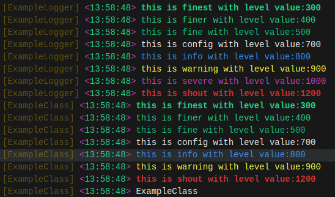

# Hemend Logger

[![style: very good analysis][very_good_analysis_badge]][very_good_analysis_link]
[![License: MIT][license_badge]][license_link]

**Simple Logging Manager that extends Logging package to manage logging system.**



## Installation 💻

**❗ In order to start using Hemend Logger you must have the [Dart SDK][dart_install_link] installed on your machine.**

Add `hemend_logger` to your `pubspec.yaml`:

```yaml
dependencies:
  hemend_logger: <latest-version>
```

Install it:

```sh
dart pub get
```

---

## Usage

This software package incorporates the [`logging`](https://pub.dev/packages/logging) package as its default logging mechanism, providing the fundamental logging functionality. However, users are afforded the opportunity to augment and enhance this logging system by integrating their own customized logging system or methods.

The present package incorporates an AnsiLogger as its intrinsic logging utility, which effectively facilitates the printing of logs within a terminal environment. However, it possesses the inherent flexibility to be extended in order to engender diverse logging capabilities. For instance, it can be augmented to support online log recording, allowing for the persistent storage of log data. Additionally, it can be further enhanced to provide in-app interactive logging systems, enabling the utilization of toast messages or similar mechanisms for conveying log information within the application interface.

### Initiation

For optimal usage, it is recommended to employ the default configuration offered by [HemendLogger]. By doing so, you can readily utilize the predefined settings and specifications without any additional customization.

```dart
HemendLogger.defaultLogger()
```

To modify the logger level of the application at the main method, utilize the `Logger.root.level = <Level>` option prior to initializing the [HemendLogger]. This approach allows you to adjust the logging verbosity and control the amount of log information generated by the application.

To enable hierarchical logging functionality, it is essential to ensure that the hierarchicalLoggingEnabled variable is set to true. This variable, which is provided by the [`logging`](https://pub.dev/packages/logging) package, allows for the proper functioning of the hierarchical logging system. By enabling this variable, you enable the hierarchical structure that enables more granular control and organization of loggers and log levels.

For the utilization of custom logging capabilities, please refer to the relevant documentation provided within the package.

### Accessibility

As the default implementation of this package is primarily a wrapper around the default Logger provided by the [`logging`](https://pub.dev/packages/logging) package, its main contribution lies in the provision of a useful mixin. This mixin can be applied to classes, thereby granting them access to additional logging functionalities. By incorporating this mixin, classes can seamlessly integrate logging capabilities into their implementation, enhancing their logging capabilities and facilitating the generation of informative log messages.

```dart
class Example with LogableObject{
  @override
  String get loggerName => 'ExampleObject';
}
```

Alternatively, you can directly utilize the default Logger class provided by the logging package, without relying on any additional mixins or custom implementations. The default Logger class offers a comprehensive set of logging functionalities that can be accessed and utilized directly in your code. By utilizing the default Logger, you can leverage the capabilities provided by the logging package in a straightforward manner, without the need for any additional extensions or mixins.

---

## Continuous Integration 🤖

Hemend Logger comes with a built-in [GitHub Actions workflow][github_actions_link] powered by [Very Good Workflows][very_good_workflows_link] but you can also add your preferred CI/CD solution.

Out of the box, on each pull request and push, the CI `formats`, `lints`, and `tests` the code. This ensures the code remains consistent and behaves correctly as you add functionality or make changes. The project uses [Very Good Analysis][very_good_analysis_link] for a strict set of analysis options used by our team. Code coverage is enforced using the [Very Good Workflows][very_good_coverage_link].

---
<!-- 
## Running Tests 🧪

To run all unit tests:

```sh
dart pub global activate coverage 1.2.0
dart test --coverage=coverage
dart pub global run coverage:format_coverage --lcov --in=coverage --out=coverage/lcov.info
```

To view the generated coverage report you can use [lcov](https://github.com/linux-test-project/lcov).

```sh
# Generate Coverage Report
genhtml coverage/lcov.info -o coverage/

# Open Coverage Report
open coverage/index.html
``` -->

[dart_install_link]: https://dart.dev/get-dart
[github_actions_link]: https://docs.github.com/en/actions/learn-github-actions
[license_badge]: https://img.shields.io/badge/license-MIT-blue.svg
[license_link]: https://opensource.org/licenses/MIT
[very_good_analysis_badge]: https://img.shields.io/badge/style-very_good_analysis-B22C89.svg
[very_good_analysis_link]: https://pub.dev/packages/very_good_analysis
[very_good_coverage_link]: https://github.com/marketplace/actions/very-good-coverage
[very_good_workflows_link]: https://github.com/VeryGoodOpenSource/very_good_workflows
